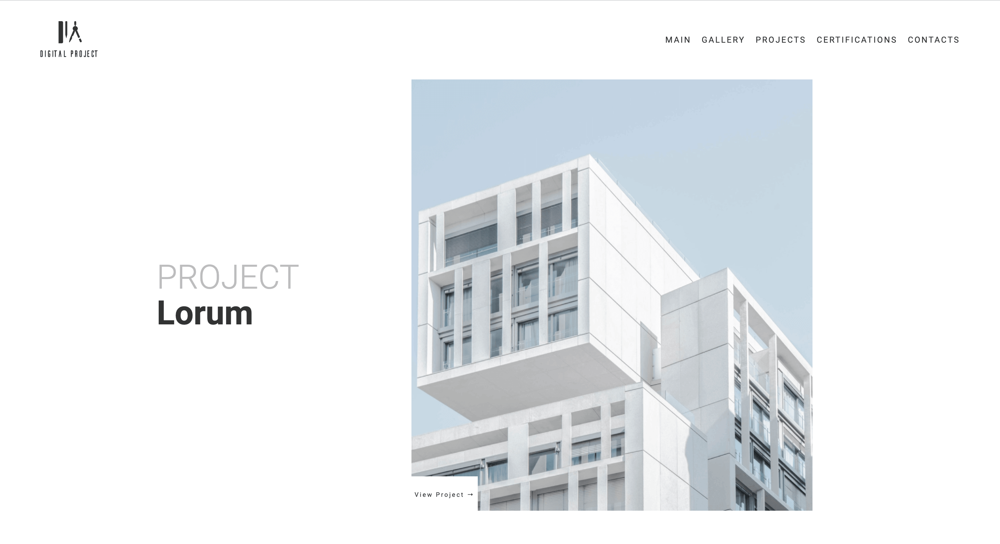
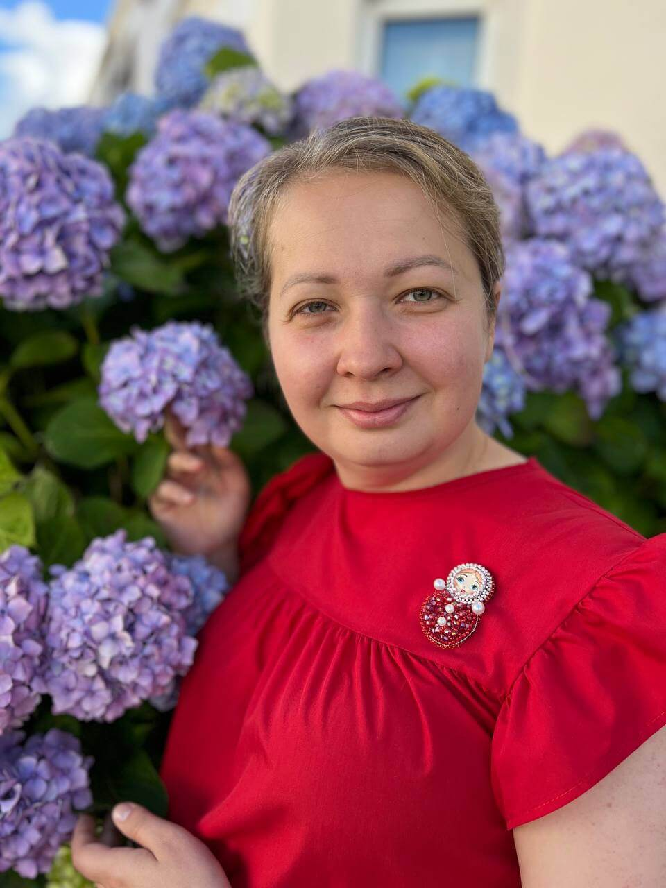
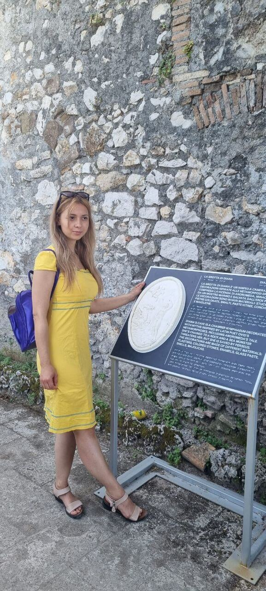
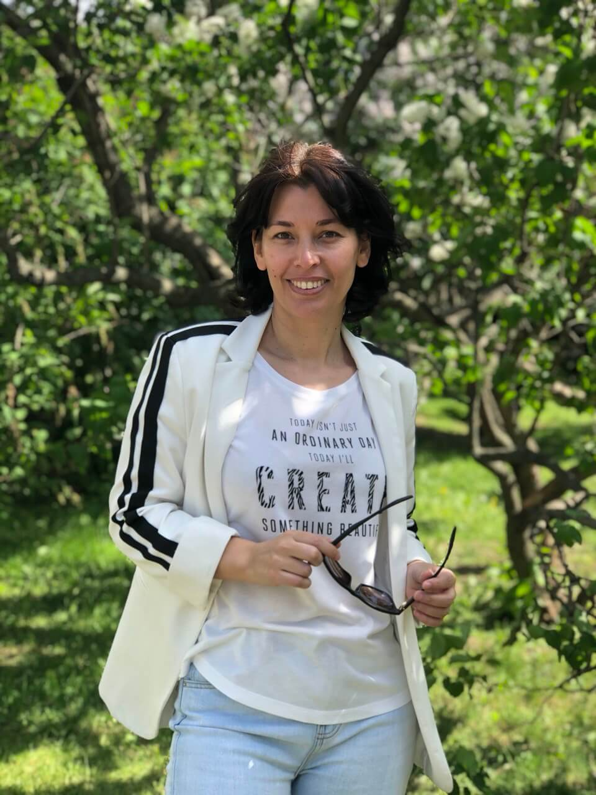
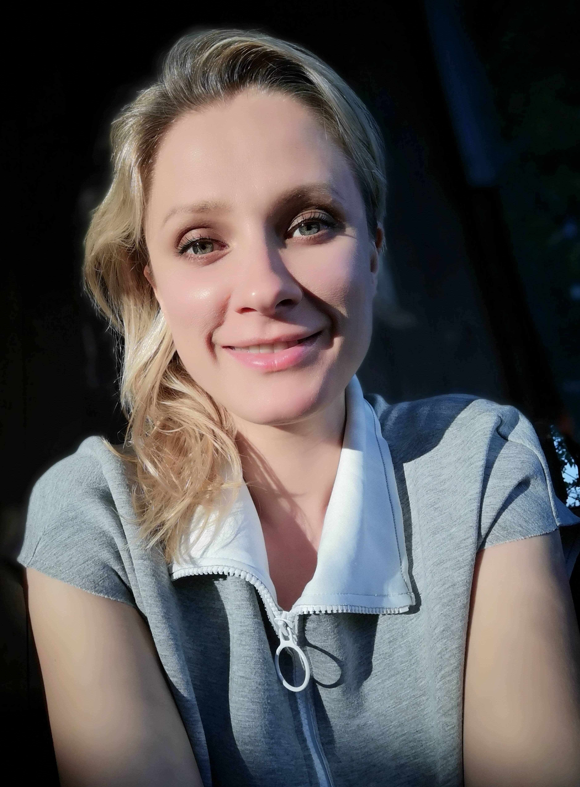

# Проект "Вэб-сайт архитектора" 
Привет! :wave: Это наш первый командный проект на HTML и CSS. Это веб-сайт архитектора, который мы создали общими усилиями, чтобы научиться основам веб-разработки и командной работы. 

При написании кода мы придерживались принципов семантической верстки, сделали сайт адаптивным: применили относительные единицы измерения, медиа-запросы, технологии grid и flex. 

Наш сайт адаптируется к экранам шириной от 250px до 5000px. На мобильных устройствах меню (header) сворачивается в бургер-меню, футер не отображается. При больших разрешениях экрана (от 1600 px) header  автоматически подстраивается под экран, увеличиваясь в размере.

В head есть фавикон, все ссылки подключены относительно, соблюдена последовательноть подключения стилей-шрифтов.Подключены стили и файл normalize.css.

Использованы псевдоклассы:

- при нажатии / наведении на ссылки меню (окрашиваются в серый цвет, подчеркиваются снизу и сверху) - см. примеры кода ниже :point_down:
- при наведении фотографии в Галерее увеличиваются - см. пример кода ниже :point_down:

Все фото и картинки проекта сжаты без потери качества

:exclamation: На странице Sample Project качество картинок в макете изначально было низким.

Кнопки и ссылки рабочие и при нажатии ведут на соответствующие страницы (кроме кнопки Read More на Главной странице в блоке About, кнопок View more y Sample Project 2 и Sample Project 3 на странице Our Projects и кнопки Contact Us на странице Сontact Information)

Все блоки прошли проверку на переполнение текста.

Соблюдена структура заголовков. 


====================================================


#### Здесь можно посмотреть на макет нашего сайта в [Figma](https://www.figma.com/file/dG69wcRxSP7ea8MD5vJRWC/Website-of-architects---free-website-(Community)?mode=dev)

<!-- #### Видеообзор-сайта при нажатии на картинку (тест):

[](assets/Images/README/Release_test.mp4) -->

#### ССЫЛКА НА САЙТ на Git Pages (МЕСТО ДЛЯ ССЫЛКИ)

====================================================


## СТРУКТУРА САЙТА

Наш веб-сайт содержит шесть страниц.

Каждая страница содержит header и footer и имеет единые отступы секции main между ними. 

#### _Стили для секции main:_


```css
.main {
  margin-left: 10%;
  margin-right: 10%;
  margin-bottom: 15%;
  max-width: 100vw;
}
```


 ### Главная страница - index.html: 
 На этой странице вы найдете информацию о проекте и контактную информацию. В форме ввода можно задать вопрос, оставив свои контактные данные, обязательные для заполнения поля отмечены звездочкой (*) На эту страницу ведет ссылка Main в header и footer. 

 Исполнители:
 header - Мария Гарифуллина
 блок Project Lorum - Екатерина Шепелева
 блок About - Мария Гарифуллина
 блок Main Focus - Екатерина Шепелева
 блок Our Project - Диана Хадиева
 блок Contact Us - Диана Хадиева
 footer - Светлана Малькова


___
### Галерея - Gallery.html: 
Здесь вы увидите фото реализованных проектов. При наведении фото увеличиваются. На эту страницу ведет ссылка Gallery в header и footer. 

Исполнитель: Шепелева Екатерина

___
### Наши проекты - our_project.html: 

Здесь представлено три проекта. Кнопка под описанием первого проекта ведет на дополнительную страницу Sample_Project1.html. На эту страницу ведет ссылка Projects в header и footer. 

Исполнитель: Диана Хадиева
___

### Проект 1 - Sample_Project1.html 

Здесь - подробное описание первого проекта. На эту страницу можно попасть только со страницы Our Projects.

Исполнитель: Мария Гарифуллина
___
### Сертификаты Проекта - Certifications.html
Это пустая страница. На эту страницу ведет ссылка Certifications в header и footer. 

Исполнитель: Шепелева Екатерина.

___
### Страница контактов - CONTACTS.html 

Здесь даны контакты для связи с компанией, а также приведена карта с маршрутом проезда. На эту страницу ведет ссылка Contacts в header и footer. 

Исполнитель: Светлана Малькова
___
## ПРИМЕРЫ КОДА

#### _Изменение цвета при нажатии на ссылку в меню:_
```css
header__container nav a:hover {
  color: grey;
  position: relative;
}
```
#### _Подчеркивание сверху и снизу при наведении на ссылку в меню:_

```css
.header__container nav a:hover::before,
.header__container nav a:hover::after {
  content: ""; /* Добавляем пустое содержимое для псевдоэлементов */
  position: absolute; /* Устанавливаем абсолютное позиционирование */
  left: 0; /* Выравниваем слева */
  right: 0; /* Выравниваем справа */
  height: 2px; /* Высота линии */
  background-color: black; /* Цвет линии */
}

.header__container nav a:hover::before {
  top: 0; /* Линия сверху */
}

.header__container nav a:hover::after {
  bottom: 0; /* Линия снизу */
}

```

#### _Медиазапрос: бургер-меню - при размере экрана меньше или равно 768 пикселей:_

```css
@media screen and (max-width: 768px) {
  .header__container {
    flex-direction: row;
  }
  [for="burger"] {
    display: block;
    /* margin-top: 10px; */
  }
  [for="burger"]::before {
    content: "☰";
    font-size: 20px;
  }
  .logo {
    width: 47%;
  }
  nav {
    display: none;
    width: 47%;
    user-select: none;
    padding: 10px 20px;
  }
  nav ul {
    flex-direction: column;
  }
  #burger:checked + label + nav {
    display: block;
  }
  #burger:checked + [for="burger"]::before {
    content: "⮾";
  }
}

```
#### _Увеличение фотографий при наведении мышки_

```css
.main__gallery {
  display: grid;
  grid-template-columns: repeat(5, 1fr);
  grid-template-rows: repeat(2, 1fr);
  justify-content: center;
  max-width: 100%;
}

.main__gallery img {
  max-width: 90%;
  max-height: 90%;
  object-fit: cover;
  margin: auto;
}

.main__gallery img:hover {
  transform: scale(1.1);
}
```

## Наша команда:

- ### Мария Гарифуллина (*Team Lead*)
  

  
- ### Диана Хадиева



- ### Светлана Малькова



- ### Екатерина Шепелева



