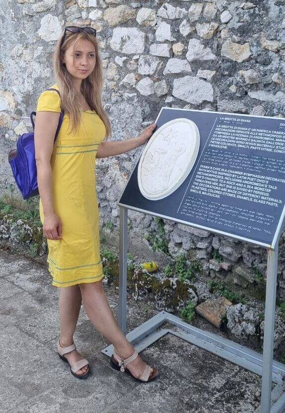

# Проект "Вэб-сайт архитектора" 
Привет! :wave: Это наш первый командный проект на HTML и CSS. Этот проект - небольшой веб-сайт архитектора, который мы создали общими усилиями, чтобы научиться основам веб-разработки. 

______

#### Здесь можно посмотреть на макет нашего сайта в [Figma](https://www.figma.com/file/dG69wcRxSP7ea8MD5vJRWC/Website-of-architects---free-website-(Community)?mode=dev)

#### А нажав на эту картинку,полюбоваться результатом нашего труда (DB ЕО ПЕРЕЗАЛЬЮ ДРУГОЕ, с последней версией сайта и демонстрацией нажатий на все кнопки, если успею, то откомментирую голосом свои действия на видео):

#### Ссылка на Git Pages (ДОБАВИТЬ ССЫЛКУ)
_____
## Герои проекта:

- ### Мария Гарифуллина (*Team Lead*)
  

  
- ### Диана Хадиева

- ### Светлана Малькова

- ### Екатерина Шепелева

